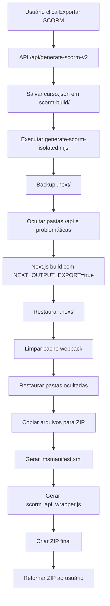

# Gerador de Cursos - Documentação Completa SCORM

**Versão**: 2.0
**Última atualização**: 14/01/2025
**Next.js**: 15.1.6
**Node.js**: 20.x

---

## 📋 Índice

1. [Visão Geral do Projeto](#visão-geral-do-projeto)
2. [Arquitetura do Sistema](#arquitetura-do-sistema)
3. [Processo de Geração SCORM](#processo-de-geração-scorm)
4. [Configuração de Componentes](#configuração-de-componentes)
5. [Troubleshooting](#troubleshooting)
6. [Estrutura de Arquivos](#estrutura-de-arquivos)

---

## 🎯 Visão Geral do Projeto

Sistema de geração de cursos educacionais com exportação para pacotes SCORM 1.2, desenvolvido com Next.js 15 App Router e Prisma ORM.

### Funcionalidades Principais

- ✅ Criação de cursos com múltiplas unidades
- ✅ Editor de conteúdo rico (markdown)
- ✅ Preview em tempo real
- ✅ Exportação SCORM 1.2 completa
- ✅ Dark mode integrado
- ✅ Integração LMS via SCORM API
- ✅ Sistema de autenticação

---

## 🏗️ Arquitetura do Sistema

### Stack Tecnológico

```
Frontend:
  - Next.js 15.1.6 (App Router)
  - React 19
  - TypeScript
  - Tailwind CSS
  - shadcn/ui

Backend:
  - Next.js API Routes
  - Prisma ORM
  - PostgreSQL (Supabase)

Build & Deploy:
  - Vercel
  - Node.js scripts isolados
```

### Estrutura de Rotas

```
/cursos                          # Lista de cursos (autenticado)
/cursos/novo                     # Criar novo curso
/cursos/[id]/preview             # Preview do curso (Client Component)
/cursos/[id]/preview/unidade/[unidadeId]  # Preview unidade (Client Component)

/scorm-preview                   # Preview SCORM (Server Component)
/scorm-preview/unidade/[unidadeId]  # Unidade SCORM (Server Component)
```

---

## 📦 Processo de Geração SCORM

### Fluxo Completo



### 1. Inicio do Processo

**Arquivo**: `src/hooks/useSCORM.ts`

```typescript
export async function generateSCORM(curso: CursoGerado, filename: string) {
  const response = await fetch('/api/generate-scorm-v2', {
    method: 'POST',
    headers: { 'Content-Type': 'application/json' },
    body: JSON.stringify({ curso, filename }),
  });

  const blob = await response.blob();
  // Download do ZIP
}
```

### 2. API Route

**Arquivo**: `src/app/api/generate-scorm-v2/route.ts`

```typescript
export async function POST(request: Request) {
  const { curso, filename } = await request.json();

  // 1. Criar arquivo JSON temporário
  const cursoFile = path.join(scormBuildDir, `curso-${curso.id}.json`);
  await fs.writeFile(cursoFile, JSON.stringify(curso, null, 2));

  // 2. Executar script isolado
  const { stdout, stderr } = await execAsync(
    `node generate-scorm-isolated.mjs "${cursoFile}" "${outputZip}"`,
    {
      timeout: 600000, // 10 minutos
      env: { ...process.env, FORCE_COLOR: '0' }
    }
  );

  // 3. Retornar ZIP
  const zipBuffer = await fs.readFile(outputZip);
  return new Response(zipBuffer, {
    headers: {
      'Content-Type': 'application/zip',
      'Content-Disposition': `attachment; filename="${filename}"`,
    },
  });
}
```

### 3. Script de Build Isolado

**Arquivo**: `generate-scorm-isolated.mjs`

#### 3.1. Backup e Ocultação

```javascript
async function backupNextDir() {
  const nextDir = path.join(process.cwd(), '.next');
  const backupDir = path.join(process.cwd(), '.next-backup-scorm');

  if (await pathExists(nextDir)) {
    await fs.rename(nextDir, backupDir);
    console.log('   ✅ Backup de .next/ criado');
  }
}

async function hideApiRoutes() {
  const appDir = path.join(process.cwd(), 'src', 'app');
  const entries = await fs.readdir(appDir, { withFileTypes: true });

  // Ocultar todas as pastas que começam com 'api'
  const apiDirs = entries
    .filter(entry => entry.isDirectory() && entry.name.startsWith('api'))
    .map(entry => entry.name);

  for (const dir of apiDirs) {
    await fs.rename(
      path.join(appDir, dir),
      path.join(appDir, `.api-hidden-temp-${dir}`)
    );
  }

  // Ocultar outras pastas problemáticas
  const problematicDirs = ['[id]', 'pdf-preview'];
  for (const dir of problematicDirs) {
    const dirPath = path.join(appDir, dir);
    if (await pathExists(dirPath)) {
      await fs.rename(dirPath, `${dirPath}-hidden-temp`);
    }
  }
}
```

#### 3.2. Build Next.js

```javascript
async function runNextBuild(cursoFile) {
  const buildEnv = {
    ...process.env,
    NODE_ENV: 'production',
    NEXT_OUTPUT_EXPORT: 'true',
    SCORM_BUILD_CURSO_FILE: cursoFile,
  };

  const buildProcess = spawn('npx', ['next', 'build'], {
    cwd: process.cwd(),
    env: buildEnv,
    stdio: ['ignore', 'pipe', 'pipe'],
  });

  // Capturar stdout e stderr
  // Aguardar conclusão
  // Retornar código de saída
}
```

#### 3.3. Restauração

```javascript
async function restoreNextDir() {
  const backupDir = path.join(process.cwd(), '.next-backup-scorm');
  const nextDir = path.join(process.cwd(), '.next');

  // Remover .next/ gerado pelo build
  await fs.rm(nextDir, { recursive: true, force: true });

  // Restaurar backup
  await fs.rename(backupDir, nextDir);

  // Limpar cache do webpack
  const cacheDir = path.join(nextDir, 'cache', 'webpack');
  if (await pathExists(cacheDir)) {
    await fs.rm(cacheDir, { recursive: true, force: true });
  }

  console.log('   ✅ .next/ restaurado');
}
```

#### 3.4. Criação do ZIP

```javascript
async function copyBuildFilesToZip(zip, outDir, publicImagesDir, curso) {
  // Copiar arquivos estáticos (_next, chunks, CSS, JS)
  const nextStaticDir = path.join(outDir, '_next', 'static');
  if (await pathExists(nextStaticDir)) {
    const files = await getAllFiles(nextStaticDir);
    for (const file of files) {
      const relativePath = path.relative(outDir, file);
      const content = await fs.readFile(file);
      zip.file(relativePath, content);
    }
  }

  // Copiar scorm-preview.html como index.html
  const scormPreviewHtml = path.join(outDir, 'scorm-preview.html');
  if (await pathExists(scormPreviewHtml)) {
    let content = await fs.readFile(scormPreviewHtml, 'utf-8');
    content = convertPaths(content, '../'); // Ajustar paths relativos
    zip.file('scorm-preview/index.html', content);
  }

  // Copiar arquivos das unidades
  const unidadeDir = path.join(outDir, 'scorm-preview', 'unidade');
  if (await pathExists(unidadeDir)) {
    const files = await fs.readdir(unidadeDir);
    for (const file of files) {
      if (file.endsWith('.html')) {
        let content = await fs.readFile(path.join(unidadeDir, file), 'utf-8');
        content = convertPaths(content, '../../');
        zip.file(`scorm-preview/unidade/${file}`, content);
      }
    }
  }

  // Copiar imagens
  if (await pathExists(publicImagesDir)) {
    const images = await getAllFiles(publicImagesDir);
    for (const img of images) {
      const relativePath = path.relative(publicImagesDir, img);
      const content = await fs.readFile(img);
      zip.file(`images/${relativePath}`, content);
    }
  }
}
```

#### 3.5. Geração de Arquivos SCORM

```javascript
function generateManifestSimple(curso) {
  return `<?xml version="1.0" encoding="UTF-8"?>
<manifest identifier="SCORM_${curso.id}" version="1.0"
          xmlns="http://www.imsproject.org/xsd/imscp_rootv1p1p2"
          xmlns:adlcp="http://www.adlnet.org/xsd/adlcp_rootv1p2"
          xmlns:xsi="http://www.w3.org/2001/XMLSchema-instance"
          xsi:schemaLocation="http://www.imsproject.org/xsd/imscp_rootv1p1p2 imscp_rootv1p1p2.xsd
                              http://www.imsproject.org/xsd/imsmd_rootv1p2p1 imsmd_rootv1p2p1.xsd
                              http://www.adlnet.org/xsd/adlcp_rootv1p2 adlcp_rootv1p2.xsd">
  <metadata>
    <schema>ADL SCORM</schema>
    <schemaversion>1.2</schemaversion>
  </metadata>
  <organizations default="ORG-${curso.id}">
    <organization identifier="ORG-${curso.id}">
      <title>${curso.titulo}</title>
      ${curso.unidades.map((unidade, index) => `
      <item identifier="ITEM-${unidade.id}" identifierref="RES-${unidade.id}">
        <title>${unidade.titulo}</title>
      </item>`).join('')}
    </organization>
  </organizations>
  <resources>
    ${curso.unidades.map((unidade) => `
    <resource identifier="RES-${unidade.id}" type="webcontent"
              adlcp:scormtype="sco" href="scorm-preview/unidade/${unidade.id}.html">
      <file href="scorm-preview/unidade/${unidade.id}.html"/>
    </resource>`).join('')}
  </resources>
</manifest>`;
}

function generateScormWrapperSimple() {
  return `
var SCORM = (function(){
  var API = null, findAPITries = 0, _debug = true;

  function log(msg) {
    if (_debug) {
      console.log('[SCORM-PLAYER] ' + msg);
    }
  }

  function findAPI(win) {
    while (win.API == null && win.API_1484_11 == null &&
           win.parent != null && win.parent != win) {
      findAPITries++;
      if (findAPITries > 500) {
        log('Erro: API não encontrada');
        return null;
      }
      win = win.parent;
    }
    return win.API_1484_11 || win.API;
  }

  function initAPI() {
    var win = window;
    API = findAPI(win);
    if (API == null && win.opener != null) {
      API = findAPI(win.opener);
    }
    if (API) {
      log('API encontrada! Versão: ' + (API.LMSInitialize ? '1.2' : '2004'));
    }
  }

  initAPI();

  return {
    API: API,
    init: function() {
      if (!API) return false;
      var result = API.LMSInitialize ? API.LMSInitialize("") : API.Initialize("");
      log('LMSInitialize: ' + result);
      return result === "true" || result === true;
    },
    terminate: function() {
      if (!API) return false;
      var result = API.LMSFinish ? API.LMSFinish("") : API.Terminate("");
      log('LMSFinish: ' + result);
      return result === "true" || result === true;
    },
    getValue: function(param) {
      if (!API) return "";
      var result = API.LMSGetValue ? API.LMSGetValue(param) : API.GetValue(param);
      return result;
    },
    setValue: function(param, value) {
      if (!API) return false;
      var result = API.LMSSetValue ? API.LMSSetValue(param, value) : API.SetValue(param, value);
      return result === "true" || result === true;
    },
    getStudentName: function() {
      var name12 = this.getValue('cmi.core.student_name');
      var name2004 = this.getValue('cmi.learner_name');
      return name12 || name2004 || 'Aluno (Convidado)';
    }
  };
})();

// Inicializar SCORM
if (typeof window !== 'undefined') {
  window.SCORM = SCORM;
  if (SCORM.init()) {
    console.log('[SCORM] Inicializado com sucesso');
  }
}

// Terminar SCORM ao sair
window.addEventListener('beforeunload', function() {
  if (SCORM && SCORM.terminate) {
    SCORM.terminate();
  }
});
`;
}
```

### 4. Variáveis de Ambiente

**Durante build SCORM**:
```bash
NODE_ENV=production
NEXT_OUTPUT_EXPORT=true
SCORM_BUILD_CURSO_FILE=/path/to/curso.json
```

**Durante desenvolvimento**:
```bash
# .env.local
DATABASE_URL="postgresql://..."
NEXT_PUBLIC_APP_URL="http://localhost:3000"
```

---

## ⚙️ Configuração de Componentes

### Arquitetura Crítica ⚠️

```
┌─────────────────────────────────────────────────────────┐
│                  SCORM Pages                            │
│           (Server Components)                           │
│                                                         │
│  • scorm-preview/page.tsx                              │
│  • scorm-preview/unidade/[unidadeId]/page.tsx          │
│                                                         │
│  export const dynamic = 'force-static'                  │
│  export const dynamicParams = false                     │
│  import fs from 'fs/promises' (estático)               │
│                                                         │
│  ├─ Dados lidos durante BUILD                          │
│  ├─ HTML gerado completamente estático                 │
│  └─ SEM RSC fetches                                    │
└─────────────────────────────────────────────────────────┘
              │
              │ renders
              ▼
┌─────────────────────────────────────────────────────────┐
│            Client Components (filhos)                   │
│                                                         │
│  • SCORMNavbar (usa hooks: useLMS, useTheme)           │
│  • ThemeProvider (gerencia dark mode)                  │
│  • UnidadeConteudo                                     │
│                                                         │
│  'use client' no topo                                  │
│  Podem usar hooks e estado                             │
└─────────────────────────────────────────────────────────┘
```

### 1. Server Components (Páginas SCORM)

**Arquivo**: `src/app/scorm-preview/page.tsx`

```typescript
import React from 'react';
import Link from 'next/link';
import { SCORMNavbar } from '@/components/SCORMNavbar';
import fs from 'fs/promises'; // ✅ Import estático

// ✅ Forçar geração estática completa
export const dynamic = 'force-static';

// Função para carregar dados durante BUILD
async function getCursoData(): Promise<CursoGerado | null> {
  if (process.env.SCORM_BUILD_CURSO_FILE) {
    try {
      const cursoFile = process.env.SCORM_BUILD_CURSO_FILE;
      const cursoData = await fs.readFile(cursoFile, 'utf-8');
      return JSON.parse(cursoData);
    } catch (error) {
      console.error('[scorm-preview] Erro ao carregar curso:', error);
    }
  }
  return null;
}

// ✅ Async Server Component
export default async function SCORMPreviewPage() {
  const curso = await getCursoData();

  if (!curso) {
    return <div>Curso não encontrado</div>;
  }

  return (
    <div className="min-h-screen bg-gray-50 dark:bg-gray-900">
      <SCORMNavbar curso={curso} showMenu={true} />
      {/* Resto do conteúdo */}
    </div>
  );
}
```

**Arquivo**: `src/app/scorm-preview/unidade/[unidadeId]/page.tsx`

```typescript
import fs from 'fs/promises';

// ✅ Configurações para rotas dinâmicas
export const dynamic = 'force-static';
export const dynamicParams = false;

// ✅ Gerar rotas estáticas para todas as unidades
export async function generateStaticParams() {
  if (process.env.SCORM_BUILD_CURSO_FILE) {
    try {
      const cursoFile = process.env.SCORM_BUILD_CURSO_FILE;
      const cursoData = await fs.readFile(cursoFile, 'utf-8');
      const curso = JSON.parse(cursoData) as CursoGerado;

      return curso.unidades?.map((unidade) => ({
        unidadeId: unidade.id,
      })) || [];
    } catch (error) {
      console.error('Erro ao gerar rotas estáticas:', error);
    }
  }
  return [];
}

async function getCursoData(): Promise<CursoGerado | null> {
  // ... mesmo código
}

// ✅ Params como Promise (Next.js 15)
export default async function SCORMPreviewUnidadePage({
  params,
}: {
  params: Promise<{ unidadeId: string }>;
}) {
  const { unidadeId } = await params;
  const curso = await getCursoData();

  // ... resto do código
}
```

### 2. Layout SCORM

**Arquivo**: `src/app/scorm-preview/layout.tsx`

```typescript
import { ReactNode } from "react";
import { ThemeProvider } from "@/components/ThemeProvider";

export default function SCORMPreviewLayout({
  children,
}: {
  children: ReactNode;
}) {
  return (
    <ThemeProvider>
      {/* SCORM API Wrapper - incluído no build */}
      <script dangerouslySetInnerHTML={{ __html: `
        console.log('[SCORM-PLAYER] Carregando SCORM API Wrapper...');
        var SCORM = (function(){
          // ... código do wrapper
        })();
        window.SCORM = SCORM;
        if (SCORM.init()) {
          console.log('✅ SCORM inicializado');
        }
      `}} />
      {children}
    </ThemeProvider>
  );
}
```

### 3. SCORMNavbar (Client Component)

**Arquivo**: `src/components/SCORMNavbar.tsx`

```typescript
"use client";

import React from "react";
import Link from "next/link";
import { Button } from "@/components/ui/button";
import { Menu, Home, User, LogOut, Moon, Sun } from "lucide-react";
import { useLMS } from "@/hooks/useLMS";
import { useTheme } from "@/hooks/useTheme";

export function SCORMNavbar({ curso, currentUnidadeId, showMenu = true }) {
  const { learnerName, isConnected } = useLMS();
  const { isDarkMode, toggleDarkMode } = useTheme();

  return (
    <nav className="fixed top-0 left-0 right-0 bg-white dark:bg-gray-800 border-b z-50 h-16 flex items-center px-4">
      {/* Menu lateral */}
      {showMenu && (
        <Sheet>
          {/* ... código do menu */}
        </Sheet>
      )}

      {/* Título do curso */}
      <div className="ml-4 flex-1">
        <h2 className="text-lg font-semibold text-gray-900 dark:text-gray-100">
          {curso.titulo}
        </h2>
      </div>

      {/* Controles */}
      <TooltipProvider>
        <div className="flex items-center gap-3">
          {/* Nome do aluno */}
          <div className="flex items-center gap-2 text-gray-700 dark:text-gray-300">
            <User className="h-5 w-5" />
            <span className="text-sm font-medium">{learnerName}</span>
          </div>

          {/* Toggle Dark Mode */}
          <Tooltip>
            <TooltipTrigger asChild>
              <Button variant="ghost" size="icon" onClick={toggleDarkMode}>
                {isDarkMode ? <Sun className="h-5 w-5" /> : <Moon className="h-5 w-5" />}
              </Button>
            </TooltipTrigger>
            <TooltipContent>{isDarkMode ? 'Modo Claro' : 'Modo Escuro'}</TooltipContent>
          </Tooltip>

          {/* Botão de Sair */}
          <Tooltip>
            <TooltipTrigger asChild>
              <Button
                variant="ghost"
                size="icon"
                onClick={() => {
                  if (isConnected && window.SCORM) {
                    window.SCORM.terminate();
                  }
                  window.close();
                }}
                className="text-red-600 hover:bg-red-50"
              >
                <LogOut className="h-5 w-5" />
              </Button>
            </TooltipTrigger>
            <TooltipContent>Sair</TooltipContent>
          </Tooltip>
        </div>
      </TooltipProvider>
    </nav>
  );
}
```

### 4. Hooks Customizados

**Arquivo**: `src/hooks/useLMS.ts`

```typescript
"use client";

import { useState, useEffect } from 'react';

declare global {
  interface Window {
    SCORM?: {
      init: () => boolean;
      terminate: () => boolean;
      getValue: (param: string) => string;
      setValue: (param: string, value: string) => boolean;
      getStudentName: () => string;
      API: any;
    };
  }
}

export function useLMS() {
  const [learnerName, setLearnerName] = useState<string>('Convidado');
  const [isConnected, setIsConnected] = useState<boolean>(false);

  useEffect(() => {
    if (typeof window !== 'undefined' && window.SCORM) {
      const connected = window.SCORM.init();
      setIsConnected(connected);

      if (connected) {
        const name = window.SCORM.getStudentName();
        setLearnerName(name || 'Convidado');
      }
    }
  }, []);

  return { learnerName, isConnected };
}
```

**Arquivo**: `src/hooks/useTheme.ts`

```typescript
"use client";

import { useState, useEffect } from 'react';

export function useTheme() {
  const [isDarkMode, setIsDarkMode] = useState(false);

  useEffect(() => {
    // Ler tema do localStorage
    const savedTheme = localStorage.getItem('theme');
    const isDark = savedTheme === 'dark' ||
                  (!savedTheme && window.matchMedia('(prefers-color-scheme: dark)').matches);

    setIsDarkMode(isDark);
    document.documentElement.classList.toggle('dark', isDark);
  }, []);

  const toggleDarkMode = () => {
    const newMode = !isDarkMode;
    setIsDarkMode(newMode);
    localStorage.setItem('theme', newMode ? 'dark' : 'light');
    document.documentElement.classList.toggle('dark', newMode);
  };

  return { isDarkMode, toggleDarkMode };
}
```

---

## 🔧 Troubleshooting

### Problema 1: Build falha com "cannot use both 'use client' and generateStaticParams()"

**Causa**: Next.js 15 não permite combinar `'use client'` com `generateStaticParams()`.

**Solução**:
```typescript
// ❌ ERRADO
'use client';
export async function generateStaticParams() { ... }

// ✅ CORRETO
// Sem 'use client' - Server Component
export const dynamic = 'force-static';
export async function generateStaticParams() { ... }
```

### Problema 2: React Error #418 e 404s no LMS

**Causa**: Server Components tentando fazer RSC fetches em pacote estático.

**Solução**:
```typescript
// ✅ Forçar geração completamente estática
export const dynamic = 'force-static';
```

### Problema 3: Tela branca após exportar SCORM

**Causa**: Cache do webpack corrompido após restore de `.next/`.

**Solução**: Script já limpa automaticamente:
```javascript
// generate-scorm-isolated.mjs
const cacheDir = path.join(nextDir, 'cache', 'webpack');
if (await pathExists(cacheDir)) {
  await fs.rm(cacheDir, { recursive: true, force: true });
}
```

### Problema 4: "curso is not defined" no script isolado

**Causa**: Parâmetro `curso` não passado para função `copyBuildFilesToZip()`.

**Solução**:
```javascript
// ✅ CORRETO
async function copyBuildFilesToZip(zip, outDir, publicImagesDir, curso) {
  // ... usar curso
}

// Chamada
await copyBuildFilesToZip(zip, outDir, publicImagesDir, curso);
```

### Problema 5: Dark mode não funciona no SCORM

**Causa**: ThemeProvider não incluído no layout SCORM.

**Solução**:
```typescript
// src/app/scorm-preview/layout.tsx
import { ThemeProvider } from "@/components/ThemeProvider";

export default function SCORMPreviewLayout({ children }) {
  return <ThemeProvider>{children}</ThemeProvider>;
}
```

### Problema 6: Pastas duplicadas causam conflito

**Causa**: Pastas como `api 2`, `pdf-preview 2` criadas pelo Finder.

**Solução**: Script oculta automaticamente:
```javascript
async function hideApiRoutes() {
  const apiDirs = entries
    .filter(entry => entry.isDirectory() && entry.name.startsWith('api'))
    .map(entry => entry.name);

  for (const dir of apiDirs) {
    await fs.rename(
      path.join(appDir, dir),
      path.join(appDir, `.api-hidden-temp-${dir}`)
    );
  }
}
```

---

## 📁 Estrutura de Arquivos

```
gerador-de-cursos/
├── src/
│   ├── app/
│   │   ├── api/
│   │   │   └── generate-scorm-v2/
│   │   │       └── route.ts              # API de geração SCORM
│   │   ├── cursos/
│   │   │   ├── [id]/
│   │   │   │   └── preview/
│   │   │   │       ├── page.tsx          # Preview normal (Client)
│   │   │   │       └── unidade/[unidadeId]/page.tsx
│   │   │   ├── page.tsx                  # Lista de cursos
│   │   │   └── novo/
│   │   │       └── page.tsx              # Criar curso
│   │   ├── scorm-preview/
│   │   │   ├── layout.tsx                # Layout SCORM com ThemeProvider
│   │   │   ├── page.tsx                  # Preview SCORM (Server)
│   │   │   └── unidade/
│   │   │       └── [unidadeId]/
│   │   │           └── page.tsx          # Unidade SCORM (Server)
│   │   └── layout.tsx                    # Root layout
│   ├── components/
│   │   ├── SCORMNavbar.tsx               # Navbar SCORM (Client)
│   │   ├── ThemeProvider.tsx             # Provider de tema (Client)
│   │   ├── UnidadeConteudo.tsx           # Conteúdo da unidade
│   │   └── ui/                           # shadcn/ui components
│   ├── hooks/
│   │   ├── useLMS.ts                     # Hook SCORM API
│   │   ├── useTheme.ts                   # Hook de tema
│   │   └── useSCORM.ts                   # Hook de geração SCORM
│   ├── context/
│   │   └── GeradorCursoContext.tsx       # Context de cursos
│   ├── types/
│   │   └── gerador-curso.ts              # TypeScript types
│   └── lib/
│       └── prisma.ts                     # Prisma client
├── prisma/
│   └── schema.prisma                     # Database schema
├── public/
│   └── images/                           # Imagens públicas
├── generate-scorm-isolated.mjs           # Script de build SCORM
├── .scorm-build/                         # Temporários SCORM (gitignored)
├── .next/                                # Build Next.js
├── .env.local                            # Variáveis de ambiente
├── next.config.mjs                       # Configuração Next.js
├── tailwind.config.ts                    # Configuração Tailwind
├── tsconfig.json                         # Configuração TypeScript
└── package.json                          # Dependencies
```

---

## 🎯 Checklist de Configuração Correta

### Build SCORM Funcionando ✅

- [ ] Server Components para páginas SCORM
- [ ] `export const dynamic = 'force-static'` em ambas páginas
- [ ] `export const dynamicParams = false` em rotas dinâmicas
- [ ] `import fs from 'fs/promises'` estático (não dinâmico)
- [ ] `generateStaticParams()` retorna todas as unidades
- [ ] `params` recebido como `Promise<{ unidadeId: string }>`
- [ ] ThemeProvider no layout SCORM
- [ ] SCORMNavbar como Client Component
- [ ] `curso` passado como parâmetro em `copyBuildFilesToZip()`

### Interface Completa ✅

- [ ] Toggle dark mode na navbar (Sun/Moon icon)
- [ ] Botão de sair vermelho (LogOut icon)
- [ ] Nome do aluno exibido (via useLMS)
- [ ] Tooltips em todos os botões
- [ ] Classes dark mode em todos elementos
- [ ] Menu lateral com lista de unidades
- [ ] Navegação entre unidades funcionando

### Sem Erros ✅

- [ ] Sem React Error #418
- [ ] Sem 404s para CSS, JS, fontes
- [ ] Sem RSC fetches (.html.txt?_rsc=)
- [ ] Sem erro "curso is not defined"
- [ ] Sem conflitos de pastas duplicadas
- [ ] Cache do webpack limpo após restore
- [ ] Backup e restore de .next/ funcionando

---

## 📝 Comandos Úteis

### Desenvolvimento
```bash
# Instalar dependências
pnpm install

# Rodar servidor de desenvolvimento
pnpm dev

# Build de produção
pnpm build

# Rodar testes (se houver)
pnpm test
```

### SCORM
```bash
# Testar script isolado manualmente
node generate-scorm-isolated.mjs "/path/to/curso.json" "/path/to/output.zip"

# Limpar cache do webpack
rm -rf .next/cache/webpack

# Limpar toda pasta .next
rm -rf .next

# Limpar pasta de build temporário
rm -rf .scorm-build
```

### Git
```bash
# Ver status
git status

# Ver diferenças
git diff

# Adicionar mudanças
git add -A

# Fazer commit
git commit -m "mensagem"

# Enviar para remote
git push
```

---

## 🚀 Deploy

### Vercel

1. Conectar repositório no Vercel
2. Configurar variáveis de ambiente:
   ```
   DATABASE_URL=postgresql://...
   NEXT_PUBLIC_APP_URL=https://seu-dominio.vercel.app
   ```
3. Deploy automático em cada push

### Considerações
- Limite de timeout no plano Hobby: 60s (ajustado via `maxDuration`)
- Exportação SCORM pode levar 30-60s dependendo do tamanho do curso
- Cache do Next.js é automaticamente gerenciado

---

## 📚 Recursos Adicionais

- [Next.js 15 Docs](https://nextjs.org/docs)
- [SCORM 1.2 Spec](https://scorm.com/scorm-explained/technical-scorm/scorm-12-overview-for-developers/)
- [Prisma Docs](https://www.prisma.io/docs)
- [Tailwind CSS](https://tailwindcss.com/docs)
- [shadcn/ui](https://ui.shadcn.com/)

---

**Última revisão**: 14/01/2025
**Versão do documento**: 2.0
**Status**: ✅ Configuração validada e funcionando
